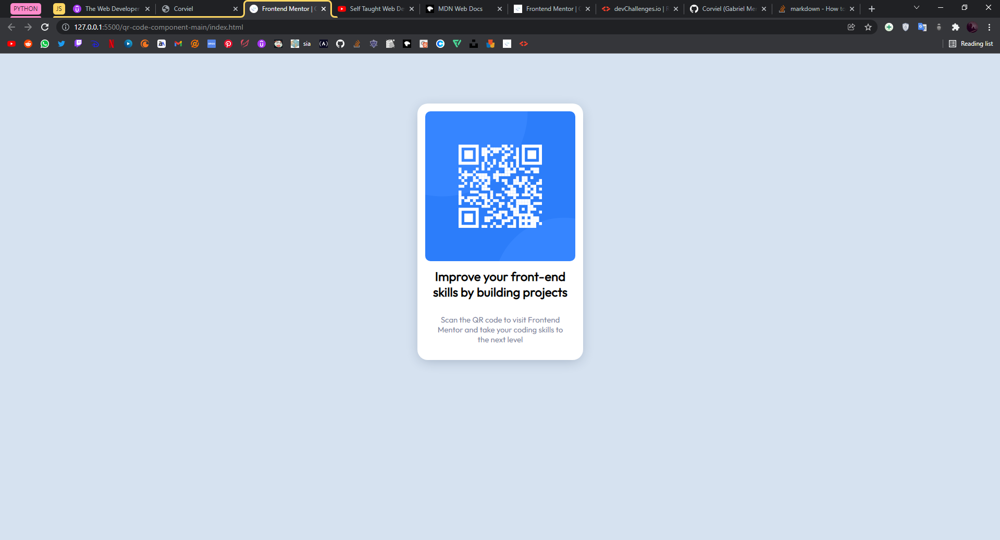

# Frontend Mentor - QR code component solution

This is a solution to the [QR code component challenge on Frontend Mentor](https://www.frontendmentor.io/challenges/qr-code-component-iux_sIO_H).

## Table of contents

  - [Overview](#overview)
    - [Screenshot](#screenshot)
    - [Links](#links)
    - [My process](#my-process)
    - [Built with](#built-with)
    - [What I learned](#what-i-learned)
    - [Useful resources](#useful-resources)
  - [Author](#author)

## Overview
  
  This is my first challenge on my HTML and CSS journey to become a web developer! Yay! 🔥

### Screenshot
  
  This is how my solution looks:

### Links

  - Solution URL: [Add solution URL here](https://github.com/Corviel/first-challenge-solution)

## My process
  
  Dove head first without knowing most of what i would do. I basically just knew i had to use some spacing (padding) between the elements that i planned to put together on a div. One would be the QR code img, the other two would be text. That's all i thought going in and i'm very proud i figured out all of it without looking up the solution. This was my first challenge!

### Built with

  - Semantic HTML5 markup
  - CSS custom properties
  - Flexbox

### What I learned

  I'm very proud to say that i learned at least enough about flexboxes to create this card. Although it's a very basic code it made me see Flexbox in a very easy way.
  Also proud to say that mostly all of the code that i used to do this was new to me, i can say i am very happy with my progres. I literally just learned what flexbox was.

### Useful resources

  - [CSS-Tricks](https://css-tricks.com/snippets/css/a-guide-to-flexbox/) - This is the first website that made me see flexboxes clearly. I enjoyed their way of showing the flexbox elements, almost like they're trying to teach a kid what flexbox is, which i found great.
  - [MDN](https://developer.mozilla.org/en-US/) - MDN, of course, as always helping me out with finding properties names and whatnot. Very useful.

## Author

  - Website - [Corviel](https://github.com/Corviel)
  - Twitter - [@Corviel](https://www.twitter.com/Corviel)
